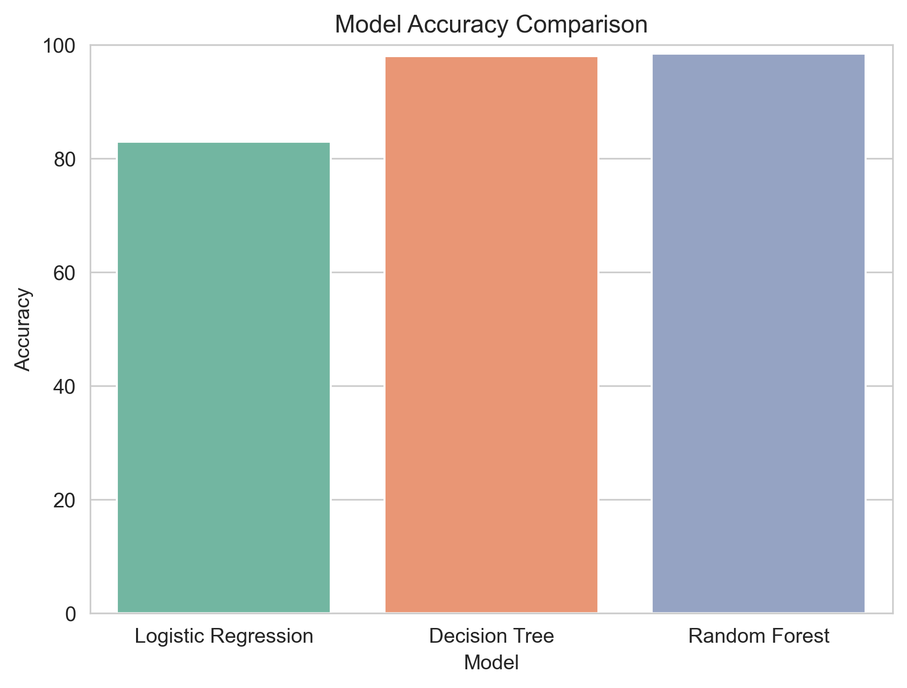
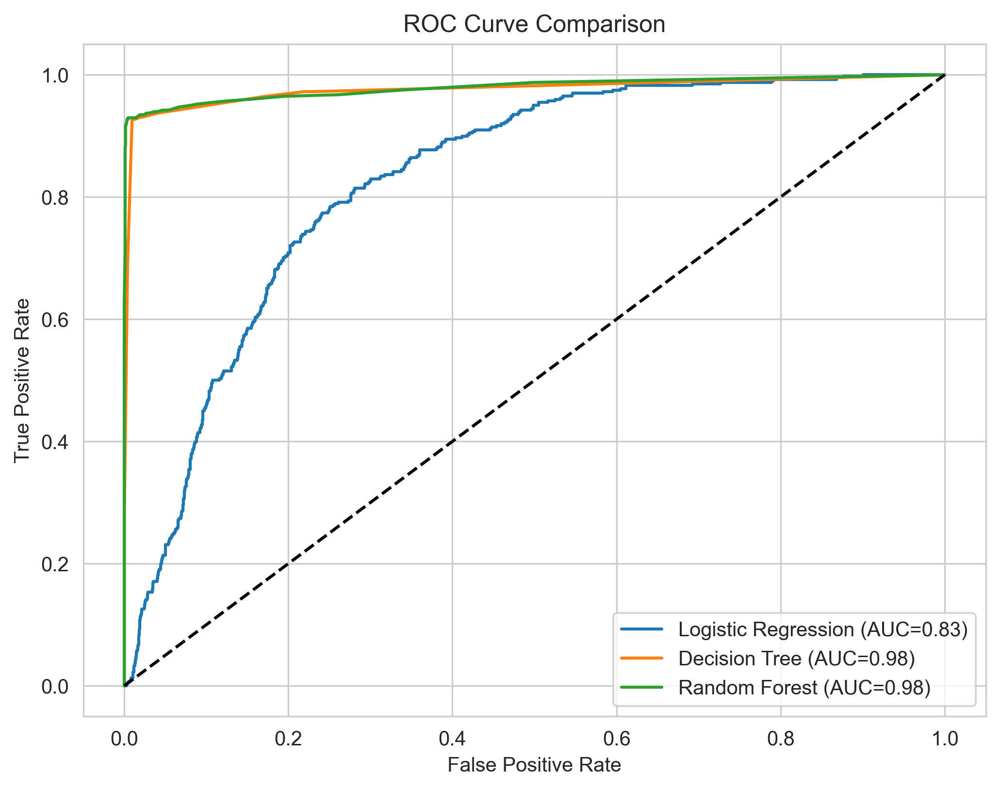
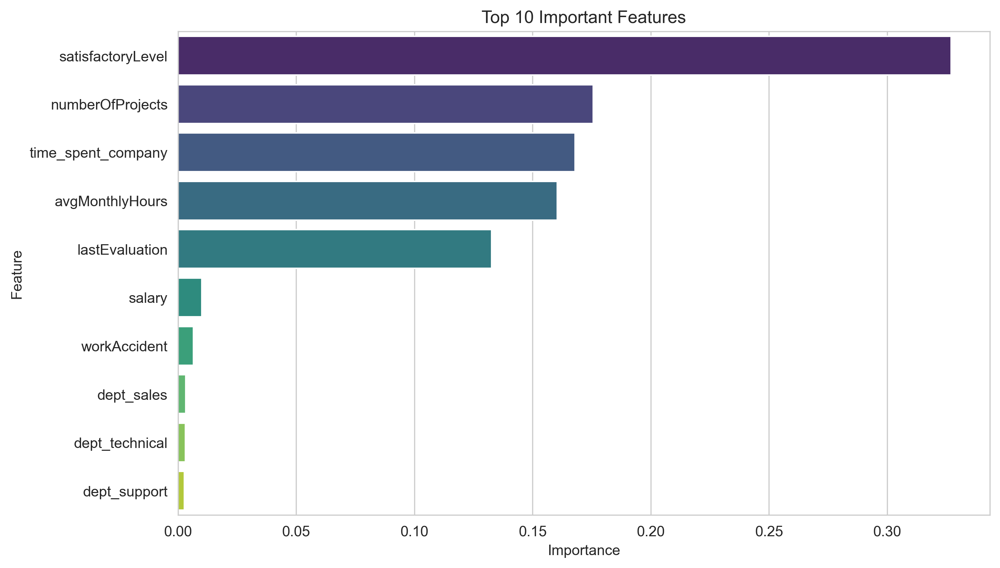
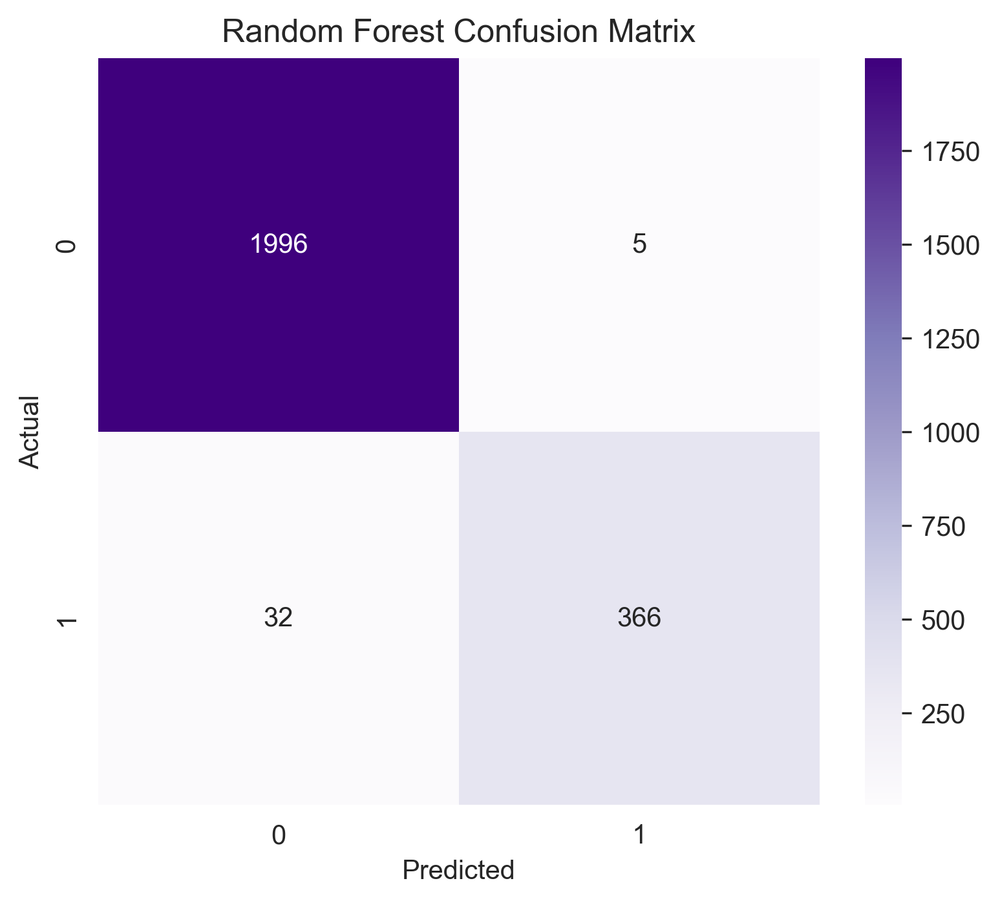

# HR Analytics - Employee Attrition Prediction
## Overview

This project predicts employee attrition using Machine Learning techniques. The goal is to identify employees who are likely to leave the organization based on HR-related factors.

## Dataset
- Total Records: 14,999
- Features: 10
- Target Variable: `left`

## Technologies Used
- Python
- Pandas
- NumPy
- Matplotlib
- Seaborn
- Scikit-learn
- Jupyter Notebook

## Machine Learning Models
- Logistic Regression
- Decision Tree Classifier
- Random Forest Classifier

## Project Workflow
1. Data Loading
2. Data Cleaning
3. Exploratory Data Analysis (EDA)
4. Feature Engineering
5. Data Preprocessing
6. Model Building
7. Model Evaluation
8. Model Comparison

## Evaluation Metrics
- Accuracy
- Confusion Matrix
- Classification Report
- ROC Curve
- Feature Importance

## Visualizations

### Model Comparison



### ROC Curve



### Feature Importance



### Random Forest Confusion Matrix



## Repository Structure
```
HR-Analytics-Employee-Attrition-Prediction/
│
├── HR_Analytics_Employee_Attrition_Prediction.ipynb
├── HR.xls
├── README.md
├── requirements.txt
└── .gitignore
```

## Author
Akshaya Vanga
